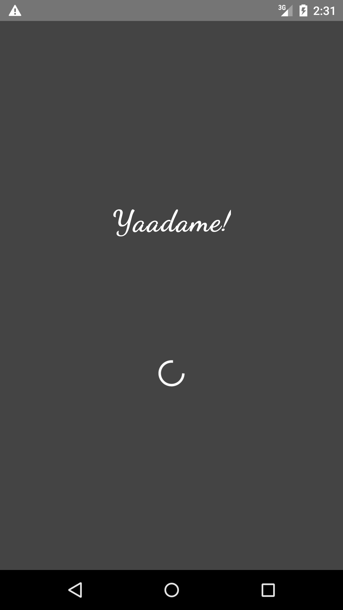
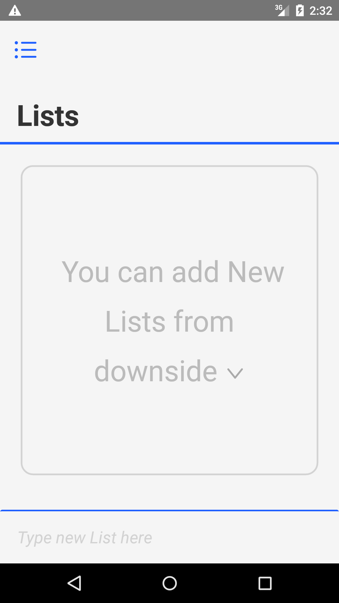
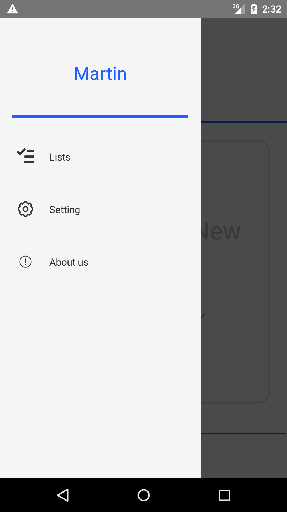
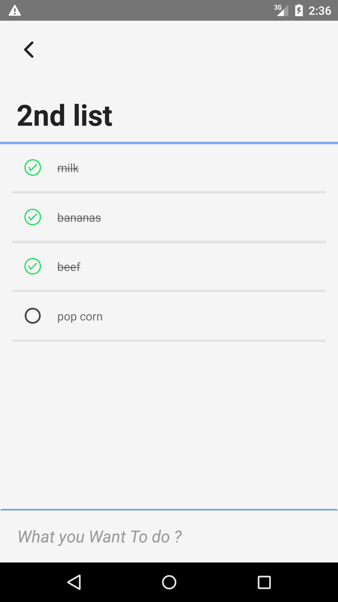
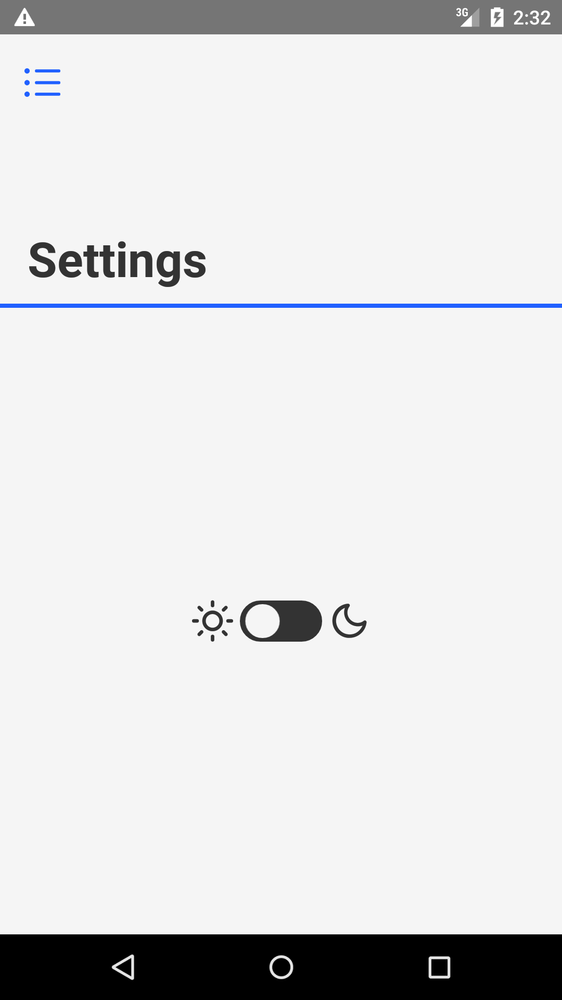

# Yaadame! 
#### Yaadame! an easy to use Todo App written in react-native

<a href="#features">&#8226; features</a> 
<a href="#technologies">&#8226; technologies</a> 
<a href="#screenshots">&#8226; screenshots</a> 

####  technologies

#### screenshots

  
  

  
  
